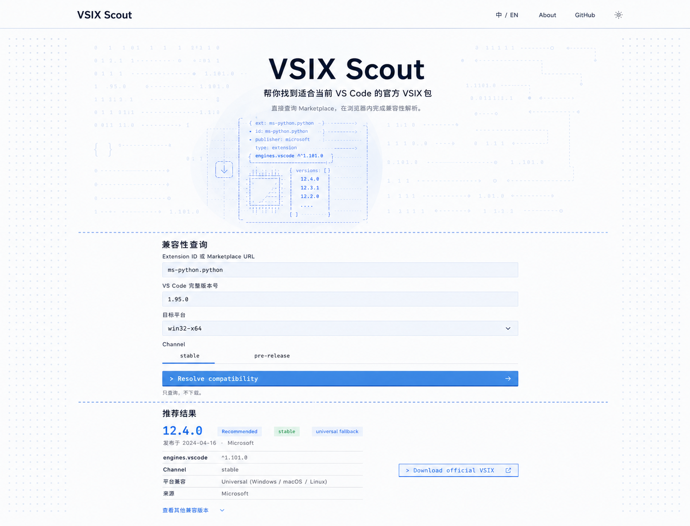
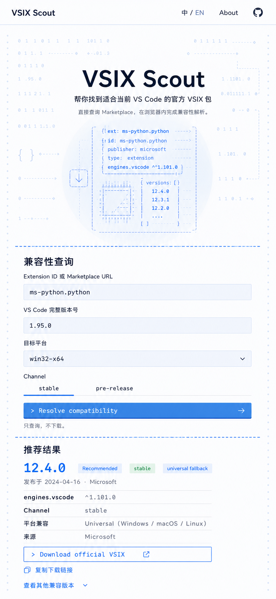

# Web Frontend Implementation Specification

This document defines the approved visual direction for the VSIX Scout Web MVP.
It supplements [Frontend Style Notes](./frontend-style-notes.md) and
[Static Web UI](./web.md). Product behavior, resolver parity, Marketplace URL
validation, and the static-only architecture remain authoritative in the existing
project documentation and tests.

## Approved design references

Desktop reference:



Mobile reference:



The images communicate composition, hierarchy, spacing, color, and interaction
intent. They are not pixel-perfect specifications and their generated sample data
must not override the real application output.

## Design direction

VSIX Scout should feel like a focused developer utility, not an admin dashboard or
a preconfigured component-library demo. The page uses one light theme, one blue
accent, open sections, strong typography, and restrained terminal-inspired detail.

The visual principles are:

- Text-only brand treatment. Do not render a graphical logo, monogram, cube, or
  package mark as the site identity.
- One centered content column for the query and result, with generous whitespace.
- No enclosing cards around the query form or resolution result.
- Sections are separated by a single dashed rule spanning the page composition.
- Desktop side whitespace contains only a faint regular dot matrix.
- The Hero contains the expressive ASCII artwork. Decorative code imagery does not
  continue into the working content column.
- Controls should look custom to VSIX Scout: flat, precise, low-radius, and closer
  to an editor command surface than a generic enterprise UI kit.

Suggested design dials:

- Design variance: 5/10
- Motion intensity: 5/10 on pointer devices, 2/10 on touch and reduced motion
- Visual density: 4/10

## Page structure

Use this semantic order:

1. Site header
2. Hero
3. Full-width dashed separator
4. Compatibility query
5. Full-width dashed separator
6. Query feedback and recommended result
7. Other compatible versions
8. Minimal footer if the existing product content requires one

The query and result share the same center axis and maximum width. On desktop use a
content width of approximately `720px`; a range of `680px` to `760px` is acceptable
after testing real labels and result values. On mobile use the available width with
`24px` page padding, reducing to `18px` only below approximately `360px`.

Do not introduce a two-column form/result layout at any breakpoint.

## Header

Desktop header target height is `64px` to `72px`. Mobile target height is `56px` to
`64px`.

- Left: text-only `VSIX Scout` link to the application base URL.
- Right: language control, `About`, GitHub link, and theme control if theme support
  is implemented.
- Desktop language label: `中 / EN`.
- Mobile must still expose language, About, and GitHub. It may use shorter labels,
  but should not hide them behind a hamburger unless they fail at the minimum
  supported width.
- External links use `rel="noopener noreferrer external"`.
- Navigation stays on one line.
- Use a fine bottom border. Avoid a floating or pill-shaped navigation container.

The initial implementation may render language and About as clearly disabled or
non-navigating placeholders only if those features are outside the active product
scope. Do not ship links that lead to missing routes. Prefer implementing the
small static About view and a minimal locale dictionary if they are included in
the release scope.

## Hero and cursor spotlight reveal

The Hero is a centered title composition over a pale-blue ASCII data texture.

Visible content:

- Heading: `VSIX Scout`
- Primary description: `帮你找到适合当前 VS Code 的官方 VSIX 包`
- Supporting sentence: `直接查询 Marketplace，在浏览器内完成兼容性解析。`

Keep the heading geometrically centered independently of the decorative artwork.
The content layer must remain readable when the reveal is directly behind it.

### Texture content

Build the decorative source as deterministic text or a static lightweight asset.
Appropriate motifs include:

- `0` and `1`
- braces, brackets, arrows, dotted rules, and code indentation
- extension metadata such as `ext`, `publisher`, and `engines.vscode`
- generic package outlines made from characters
- compatible version lists
- a generic download arrow

Do not copy the VS Code logo or any third-party brand illustration. The ASCII layer
is decorative and must use `aria-hidden="true"`.

### Pointer behavior

Implement a cursor spotlight reveal only inside the Hero:

- Track pointer coordinates relative to the Hero, not the whole document.
- Store continuous pointer coordinates in CSS custom properties, refs, or motion
  values. Do not update React state on every pointer movement.
- Reveal the stronger ASCII layer through a radial mask centered on the pointer.
- A useful starting radius is `150px` to `220px` on desktop, with a soft falloff.
- The base texture remains visible at very low contrast. The revealed layer uses
  the same blue hue at higher opacity, not a glow or a second accent color.
- Pointer movement must never move layout, text, or controls.
- Limit animation to mask position and opacity.

A practical layering model is:

1. Pale-blue Hero background
2. Low-opacity full ASCII texture
3. Higher-opacity duplicate texture masked by a pointer-positioned radial gradient
4. Centered Hero copy

Use native CSS `mask-image` and custom properties when browser support is adequate.
A small isolated React component may handle pointer events. Do not add a large
animation dependency only for this effect.

### Touch and reduced motion

- On coarse-pointer or touch devices, show one static, softly revealed region in a
  deliberate location below the title.
- Under `prefers-reduced-motion: reduce`, do not follow the pointer. Use the same
  static composition.
- The page remains complete if masks are unsupported: display only the faint base
  texture or a static stronger patch.

## Section separators and side dot matrix

Use one dashed horizontal rule between major sections. It should read as a section
boundary, not as a container edge.

Suggested characteristics:

- `1px` dashed stroke
- Blue at approximately 45% to 65% opacity
- Dash rhythm around `5px 7px`
- Spans the page composition or viewport while the section content stays centered
- Adequate vertical breathing room on each side

The desktop side gutters use only a regular dot matrix in very pale blue. Do not
place circuit paths, package diagrams, code strings, or floating cards in these
gutters. Fade or reduce the dot matrix on narrow screens so it does not compete
with labels. It may become two subtle one-dot-wide rails on mobile.

## Color tokens

Use semantic CSS variables so later theme work does not require component rewrites.
These values are starting points and should be adjusted only to satisfy contrast or
browser rendering:

```css
:root {
  --canvas: #fbfdff;
  --surface-subtle: #f2f8fc;
  --hero: #eaf6ff;
  --hero-soft: #d5ecfa;
  --ink: #10243d;
  --ink-muted: #52657a;
  --line: #b9d8ec;
  --dot: #c9e4f5;
  --accent: #2e8cd6;
  --accent-hover: #247fc6;
  --accent-active: #1d70b3;
  --success: #217a4a;
  --focus: #126fba;
}
```

The blue accent is the only decorative accent color. Green is reserved for real
semantic success or stable status. Avoid purple, violet, neon glow, gradient text,
and large saturated gradient backgrounds.

## Typography

Prefer a neutral contemporary sans for interface copy and a compatible monospace
face for versions, constraints, ASCII art, and command-style actions.

- Preferred sans direction: Geist, Satoshi, or the best existing locally bundled
  system stack.
- Preferred mono direction: Geist Mono, IBM Plex Mono, or a system monospace stack.
- Do not add a remote font dependency solely for visual fidelity. If fonts are
  added, self-host them and use `font-display: swap`.
- Hero heading should remain on one line at normal desktop and mobile widths.
- Use weight, spacing, and color for hierarchy rather than an oversized heading.
- Code values such as `12.4.0`, `^1.101.0`, platform identifiers, and the command
  button label may use the monospace face.

## Query form

The form is an open section on the page background. Do not wrap it in a card.

### Fields

- Preserve the existing field order and names.
- Labels remain above controls.
- Target input height: `50px` to `54px`.
- Maximum corner radius: `6px`.
- Use a subtle mist-blue fill and a precise border or lower edge.
- Do not use floating labels, placeholder-only labels, leading decorative icons, or
  oversized select chevrons.
- Focus uses a visible blue outline or border with at least `2px` visual weight.
- Error text appears directly below the associated field and is connected with
  `aria-describedby`.

### Channel selector

Present stable and pre-release as two text tabs over one common hairline. The active
option is identified by a blue underline, stronger text, and its native checked
state for assistive technology.

- Keep real radio inputs in the accessibility tree.
- Arrow keys or normal radio keyboard behavior must work.
- Do not render a rounded segmented container or two pill buttons.
- The selected state must not rely on color alone.

### Resolve button

The primary action should resemble an intentional command surface:

- Rectangular, maximum `6px` radius
- Solid medium-light blue, not a gradient
- Monospace `>` prefix and arrow at the far edge
- Thin darker bottom edge or small `2px` offset shadow for tactile depth
- Hover: slightly darker fill and at most `translateY(-1px)`
- Active: remove the offset or use `translateY(1px)`
- Focus-visible: high-contrast outline outside the button
- Loading: retain the button width and label context; use a subtle inline progress
  treatment rather than a generic circular spinner
- Disabled: still legible and clearly non-interactive

The visible label may remain `Resolve compatibility` to match the approved design,
or be localized consistently with the rest of the active locale. Do not mix locale
styles accidentally.

## Results and state rendering

The result is another open section, not a card. Keep the existing application state
machine and data semantics.

### Success

Emphasize:

- Extension ID and display name
- Recommended version
- `engines.vscode`
- stable or pre-release channel
- actual target platform
- universal fallback status
- publication time
- concise selection explanation
- official Microsoft VSIX download link
- copy URL action
- Marketplace reported SHA-256 when available
- other compatible versions disclosure

Use whitespace and small grouped metadata clusters. A few hairlines may separate
logical groups, but do not put borders above and below every row. Labels should be
restrained and mostly rectangular; avoid turning every value into a pill.

The official download remains a normal anchor. The application must not fetch the
VSIX. Preserve all existing URL allowlist validation and safe external-link
attributes.

### Loading

- Keep the form visible and stable.
- Announce loading through the existing live-region behavior.
- Use short line-shaped placeholders matching the result layout if a visual loading
  treatment is needed.
- Do not shift the page horizontally or replace the entire page.

### Empty and error states

The idle, invalid input, extension-not-found, no-compatible-version, Marketplace
429, network/schema, and manifest fallback states use the same open result section.
Do not add modal dialogs or large alert cards.

- Place the state title at the result heading position.
- Put the actionable explanation immediately below it.
- Associate validation errors with their source fields when possible.
- Render Marketplace-derived strings as text only.
- Never render raw payloads, README HTML, or untrusted markup.

## Responsive behavior

### Desktop, `>= 1024px`

- Header content may use a wider container than the workflow.
- Hero copy is centered in a moderate-height field.
- Query and result are a centered single column around `720px`.
- Dot matrix occupies the wide side gutters.
- ASCII spotlight follows fine-pointer movement inside the Hero.

### Tablet, `768px` to `1023px`

- Preserve the single-column workflow.
- Reduce Hero texture density and side-dot opacity.
- Keep header navigation on one line where possible.

### Mobile, `< 768px`

- Use a strict single column.
- Page content padding is approximately `24px`.
- Header labels are compact but remain discoverable.
- Hero ASCII artwork is reduced and statically revealed below or behind the copy.
- Dot matrix becomes subtle side rails and must not reduce usable content width.
- Inputs and actions are full width with minimum `44px` touch targets.
- Metadata wraps by logical group rather than shrinking text.
- Download and copy actions stack when required.

Test at minimum at `320px`, `375px`, `390px`, `768px`, `1024px`, and `1440px`.

## Accessibility and motion

- Preserve semantic landmarks, heading order, form labels, fieldsets, and live
  regions.
- Maintain visible keyboard focus on every control and link.
- Body text and form labels must meet WCAG AA contrast.
- Do not rely on blue/green color alone for channel or status meaning.
- Decorative ASCII and dots are hidden from assistive technology and cannot receive
  pointer events.
- Pointer effects cannot obscure, reposition, or capture interaction from content.
- Honor `prefers-reduced-motion` and coarse-pointer fallbacks.
- Keep the page usable at 200% zoom and with increased text spacing.
- Avoid `dangerouslySetInnerHTML`.

## Implementation boundaries

This redesign must not change the Web MVP architecture:

- Keep the React and Vite static application in `apps/web`.
- Keep the `/vsix-scout/` production base path.
- Keep browser-direct Marketplace requests.
- Reuse the Marketplace schemas, normalizers, URL policy, and core resolver.
- Do not introduce a UI component library unless a specific accessibility gap cannot
  be met with the existing stack.
- Do not add a backend, proxy, SSR, file hosting, or browser-side VSIX fetching.
- Do not store Marketplace payloads in local storage.
- Preserve shareable query parameters and existing preference persistence.

## Suggested component boundaries

Keep boundaries small and functional. Names are illustrative:

- `SiteHeader`
- `HeroAsciiReveal`
- `SectionDivider`
- `DotMatrixRails`
- `ResolveForm`
- `ChannelSelector`
- `CommandButton`
- `ResolutionFeedback`
- `RecommendedResult`
- `OtherCompatibleVersions`

`HeroAsciiReveal` should be the only pointer-motion island. Keep resolver and request
logic outside visual components. Do not duplicate the existing resolution rules in
presentation code.

## Verification checklist

Before considering the redesign complete, verify:

- Desktop and mobile layouts visually match the two approved references.
- No graphical logo appears.
- Hero, form, and result remain centered on one axis.
- Form and result have no enclosing card or panel.
- A single dashed rule separates each major section.
- Side whitespace contains only the dot matrix.
- The pointer reveal works on desktop and degrades safely on touch and reduced
  motion.
- Form labels, keyboard behavior, focus indicators, and errors remain accessible.
- All required loading, success, empty, and error states are styled.
- Marketplace strings are rendered as text, never trusted HTML.
- Download links pass the existing allowlist and remain normal anchors.
- Web and CLI still resolve the shared fixtures identically.
- Existing CLI tests and packaging are unaffected.
- `pnpm check` passes.
- The Web production build succeeds under `/vsix-scout/`.
- A real browser query works at desktop and mobile viewport sizes.
- The browser never fetches a VSIX into application memory.

## Handoff note

When implementation begins, inspect the current `apps/web` markup and preserve its
working state handling before restructuring presentation. Implement the page shell,
tokens, and responsive layout first; add the decorative ASCII reveal only after the
form and all result states are stable and accessible.
